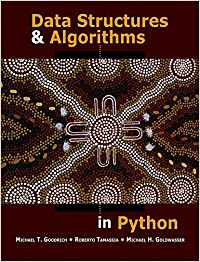

# Solutions-to-Data-Structures-and-Algorithms-in-Python
[My Solutions] Data Structures and Algorithms in Python (Michael T. Goodrich)

My solutions to the Data Structures and Algorithms in Python textbook by Michael T. Goodrich.  Solutions may not be optimal, but relied on the concepts taught in that chapter.

